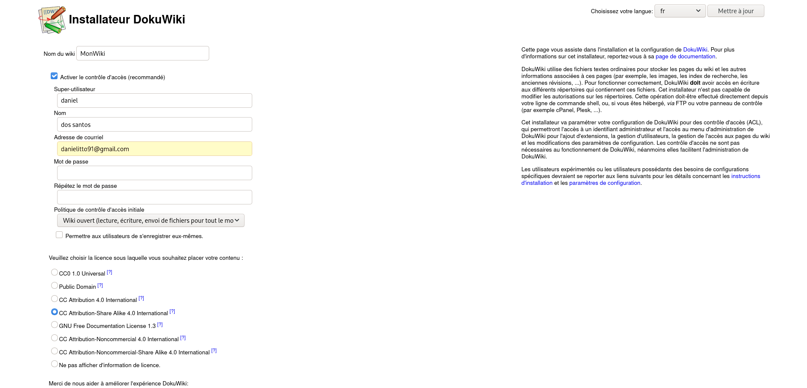

# :whale2: Image Docker de Dokuwiki personalisée
## Configuration de php.ini incluse.

 Dockerfile permettant d'avoir une image près à l'emplois de Dokuwiki:
 * Installation d'Apache2.4.
 * Installation de PHP7.3.
 * Installation et configuration de Dokuwiki 2018-04-22c.
 * Configuration de php.ini.
 * Configuration des VirtualHosts.
 * Image basé sur Debian 10 (Buster).

## Usage

#### Pour construire l'image
1. `git clone https://github.com/DOSSANTOSDaniel/Dokuwiki_Dockerfile.git` 
2. `cd Dokuwiki_Dockerfile` 
3. `docker image build --tag montag .`

#### Pour créer et démarrer un conteneur 
`docker run -d -p 80:80 -p 443:443 "id_image"`

#### Pour créer et démarrer un conteneur avec un volume  
`docker run -d -v /home/host/dockervolume:/var/www/html -p 80:80 -p 443:443 "id_image"`

## Volumes
 * "/home/host/dockervolume" Volume sur le host.
 * "/var/www/html" Volume dans le conteneur.
 
### Pour la suite
- [ ] Ajouter des variables
- [ ] Revoir sécurité .htaccess
- [ ] Erreur apache2: Could not reliably determine the server's fully qualified domain name
- [ ] Avertissement espaces vides avec sed et apt
- [ ] Utilisation de debian_frontend=noninteractive
- [ ] Message apt-utils
- [ ] Message apt cli instable
